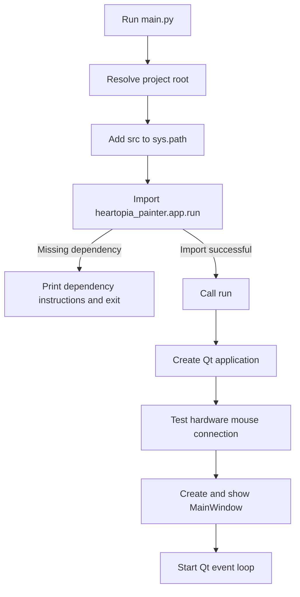
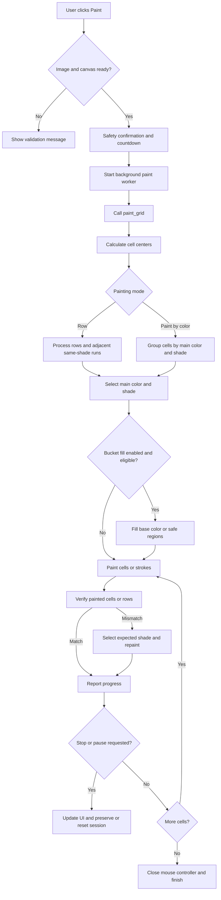
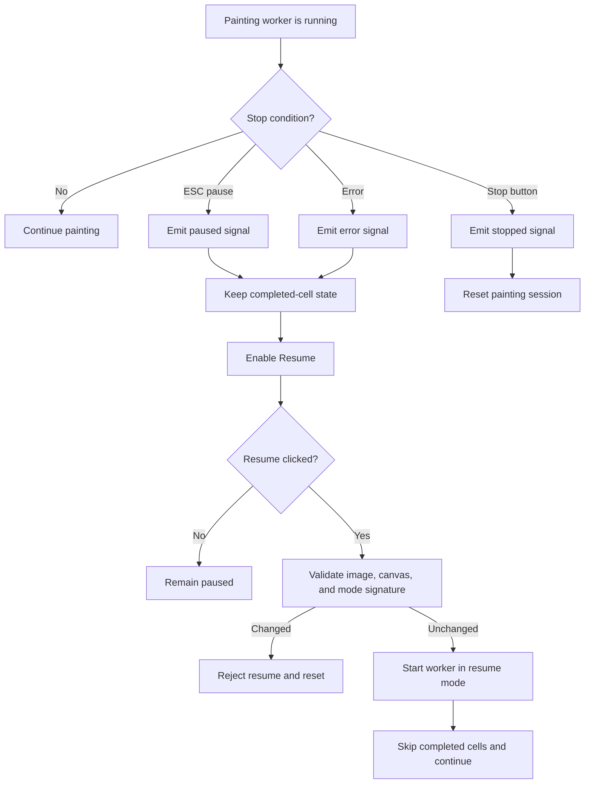
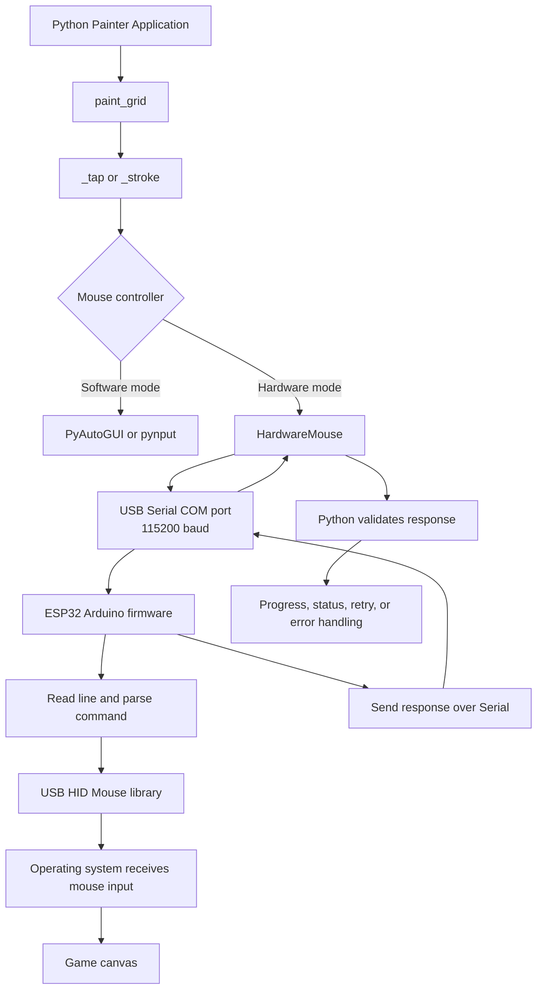
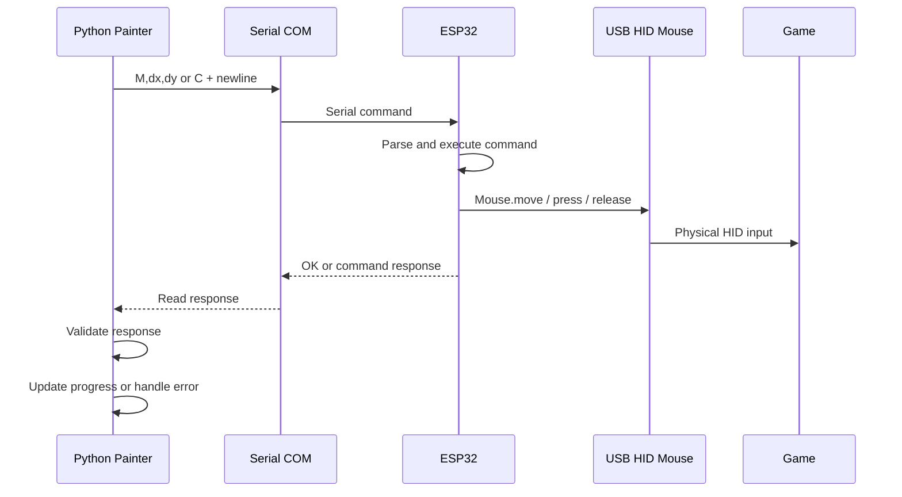

# Heartopia Auto Painter: Runtime and Painting Flow

This document describes how the application starts, converts an image into paint actions, and optionally sends mouse commands through an ESP32 HID device.

## 1. Application Entry Point

`main.py` is the launcher for the application. It does not contain the painting algorithm.

Its responsibilities are:

1. Resolve the project root from the location of `main.py`.
2. Resolve the local `src` directory.
3. Add `src` to `sys.path` when it is not already present.
4. Import `heartopia_painter.app.run`.
5. Display installation instructions when a required dependency is missing.
6. Call `run()` when `main.py` is executed directly.



The main runtime entry point is `heartopia_painter.app.run()`. It creates the Qt application, applies the global style, checks the optional hardware mouse connection, creates `MainWindow`, and starts `app.exec()`.

## 2. Main Runtime Modules

| Module | Responsibility |
|---|---|
| `main.py` | Python entry point and dependency error message |
| `app.py` | Qt UI, configuration workflow, worker thread, progress, pause, stop, and resume |
| `image_processing.py` | Load an image and resize it into a `PixelGrid` |
| `config.py` | Store canvas, color, shade, mouse, timing, and feature settings |
| `paint.py` | Convert grid cells into color selections and mouse actions |
| `hardware_mouse.py` | Serial communication with Arduino/ESP32 HID hardware |
| `enhanced_paint.py` | Optional mouse controller, timing, movement curves, and human-like behavior |
| `overlay.py` | Canvas selection, point selection, markers, and status overlay |
| `screen.py` | Read pixels from the screen for UI checks and verification |

## 3. Image-to-Canvas Painting Flow

The painting process starts in `MainWindow._on_paint()` and runs in a background worker created by `MainWindow._start_paint_worker()`.

Before the worker starts, the UI checks that an image, canvas rectangle, main colors, shades panel button, and back button have been configured. The user must also confirm the safety prompt and focus the game window during the countdown.

### Image preparation

When the user loads an image, `app.py` calls:

```python
load_and_resize_to_grid(path, w, h)
```

The selected preset determines the grid dimensions. The result is a `PixelGrid`, which provides the RGB value for each logical cell. The grid is later mapped evenly onto the selected canvas rectangle.

### Painting algorithm

`paint_grid()` in `paint.py` performs the following work:

1. Validate the grid dimensions and required color configuration.
2. Create an optional enhanced or hardware mouse controller.
3. Calculate the center position of every logical grid cell.
4. Combine the user stop callback with the optional session time limit.
5. Select the requested painting mode:
   - **Row mode:** process rows from left to right and combine adjacent cells with the same shade into a stroke when enabled.
   - **Paint-by-color mode:** preprocess all cells, group them by main color and shade, then paint the largest groups first to reduce palette switching.
6. Match each image RGB value to the closest configured shade using `_find_best_match()`.
7. Select the main color and shade through `_select_shade()`.
8. Paint each cell using `_tap()` or a continuous `_stroke()`/`_rapid_click_stroke()`.
9. Optionally use a base bucket fill or region bucket fill for large areas.
10. Verify painted cells or rows by reading the screen and repair mismatches when needed.
11. Emit progress and status callbacks to the UI.
12. Close the hardware mouse connection in the cleanup path.



## 4. Color Matching and Palette Selection

The configured palette contains `MainColor` entries. Each main color has one or more `ShadeButton` entries. A shade contains:

- A screen position for the shade button.
- An RGB value used for matching.
- A display name.

For every source pixel, `_find_best_match()` compares the source RGB value with configured shades and chooses the closest match. `_select_shade()` manages the in-game palette state:

1. Return to the main color panel when necessary.
2. Click the required main color.
3. Open the shades panel.
4. Click the required shade.
5. Use screen sampling and retries when UI sanity checking is enabled.

The selected button positions can be randomized slightly when the relevant randomness options are enabled.

## 5. Verification, Stop, Pause, and Resume

Verification reads the actual screen color at a cell center and compares it with the expected shade using the configured tolerance. A mismatch is repainted. Verification can operate as:

- Streaming verification while painting, with a configurable lag.
- Row or color-group verification after the initial paint pass.

The UI uses a stop flag shared with the worker:



Resume is rejected if the image, grid size, canvas rectangle, selected preset, or paint mode changed since the previous session. The completed-cell set is used to skip cells already reported as painted.

## 6. Software and Hardware Mouse Paths

`paint.py` uses `_tap()` and `_stroke()` as the common action layer. Depending on configuration, actions are sent through:

- **Software mode:** PyAutoGUI or `pynput`.
- **Hardware mode:** `MouseController`, backed by `HardwareMouse` and a serial-connected Arduino/ESP32 device.

If hardware initialization or connection fails, the application logs a warning and falls back to software mouse control where possible.

## 7. Python to ESP32 to Game Flow

The ESP32 is not given the image or color data. The Python application performs the image processing, palette selection, canvas coordinate calculation, and action sequencing. The ESP32 only receives low-level mouse commands and exposes them to the operating system as USB HID input.



## 8. ESP32 Connection and Handshake

`HardwareMouse.connect()` opens a serial port at **115200 baud**. When no port is explicitly configured, `_auto_detect_port()` searches available ports using:

- Device description keywords such as `arduino`, `leonardo`, and `pro micro`.
- Manufacturer information.
- Known Arduino/Pro Micro VID/PID values.

The firmware initializes Serial and the HID mouse in `setup()`, then sends:

```text
READY
VERSION:<firmware version>
```

The Python side can use `ping()`, `get_status()`, and version-related commands to check the device. The connection is closed when painting finishes or when the controller is cleaned up.

## 9. Serial Command Protocol

Commands are sent as UTF-8 text lines terminated by a newline. The ESP32 reads one line, trims it, parses it, executes the corresponding HID action, and normally sends `OK`.

| Python action | Serial command | ESP32 action | Response |
|---|---|---|---|
| Relative movement | `M,dx,dy` | Move HID mouse relatively | `OK` |
| Smooth movement | `MS,dx,dy,steps` | Move through multiple steps | `OK` |
| Mouse down | `D` | Press the left mouse button | `OK` |
| Mouse up | `U` | Release the left mouse button | `OK` |
| Full click | `C` | Press, hold 50 ms, and release | `OK` |
| Device wait | `W,milliseconds` | Delay on the ESP32 | `OK` |
| Ping | `P` | Health check | `PONG`, followed by protocol acknowledgment |
| Status | `S` | Return command/move/click counters and delay | `STATUS:...` plus protocol acknowledgment |
| Version | `V` | Return firmware version/date | `VERSION:...` plus protocol acknowledgment |
| Set movement delay | `SETDELAY,microseconds` | Set minimum interval between moves | `OK` |

### Movement limits

The HID mouse library accepts movement values in the range `-127..127` per HID call. The ESP32 firmware splits larger `M,dx,dy` values into safe chunks before sending them to `Mouse.move()`.

`HardwareMouse.move_smooth()` can also split a movement into multiple serial commands. The firmware's `MS,dx,dy,steps` handler provides an additional stepped movement implementation.

### Error behavior

- If Python is not connected, `HardwareMouse` raises `HardwareMouseError`.
- Serial failures are converted into `HardwareMouseError`.
- A response timeout produces no response and causes command validation to fail.
- Unknown firmware commands return `ERROR:UNKNOWN:<command>`.
- If hardware setup fails, the enhanced mouse layer attempts to use software control instead.

## 10. Command Lifecycle



The protocol is synchronous at the Python command layer: Python sends a command and waits for the expected response before treating that action as successful.

## 11. Configuration Files and Important Settings

The application configuration controls the painting behavior and captured UI positions. Important settings include:

- `config.json`: canvas presets, last selections, color/shade definitions, button positions, paint mode, bucket fill, verification, and status overlay settings.
- `mouse_config.json`: serial port, hardware mouse enablement, timing, movement randomness, delays, breaks, fatigue, and session limits.

When changing the painting behavior, check both the UI mapping in `app.py` and the consuming logic in `paint.py`. When changing ESP32 communication, update both `hardware_mouse.py` and `Arduino_Mouse.ino` as a protocol pair.

## 12. Safe Change Points for Future Maintenance

| Change needed | Primary location | Related location |
|---|---|---|
| Change application startup | `main.py` | `app.py:run()` |
| Change image sizing or grid data | `image_processing.py` | `app.py:_on_load()` |
| Change color matching | `paint.py:_find_best_match()` | `config.py` |
| Change row/color painting strategy | `paint.py:paint_grid()` | `paint.py:_paint_grid_by_color()` |
| Change mouse click/stroke behavior | `paint.py:_tap()` / `_stroke()` | `enhanced_paint.py` |
| Change ESP32 command protocol | `hardware_mouse.py` | `esp32/Arduino_Mouse/Arduino_Mouse.ino` |
| Change pause/resume behavior | `app.py:_start_paint_worker()` | `app.py:_on_resume()` |
| Change verification and repair | `paint.py` verification helpers | `app.py` callbacks |

When changing a serial command, update the Python sender, ESP32 parser, response handling, and protocol documentation together.

## Source References

- `main.py`
- `src/heartopia_painter/app.py`
- `src/heartopia_painter/paint.py`
- `src/heartopia_painter/image_processing.py`
- `src/heartopia_painter/config.py`
- `src/heartopia_painter/hardware_mouse.py`
- `esp32/Arduino_Mouse/Arduino_Mouse.ino`
